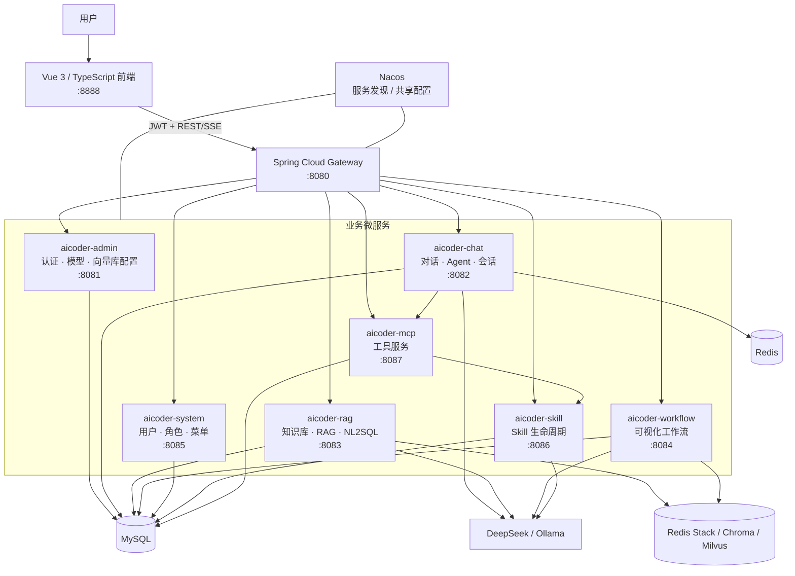

# AI Coder

AI Coder 是一个基于 Java 17、Spring Boot、Spring Cloud Alibaba、Spring AI 与 Vue 3 构建的一站式 AI 应用开发平台。项目将多模型管理、流式对话、RAG 知识库、NL2SQL、可视化工作流、MCP 工具调用、Agent Skill 生命周期以及 RBAC 系统管理整合在同一套微服务架构中。

本 README 描述当前仓库中已经实现的功能、运行依赖和本地启动方式。

## 核心能力

- 用户注册、登录、JWT 鉴权与个人信息管理。
- Ollama 本地模型与 DeepSeek 云端模型的统一配置和动态加载。
- 普通对话、SSE 流式输出、会话历史与模型切换。
- 基于 MCP 工具的多轮 Agent 调用。
- 知识库创建、文档解析、切分、向量化、检索与 RAG 问答。
- Redis Stack、Chroma、Milvus 三种向量数据库动态配置。
- DDL 知识库、自然语言生成 SQL、SQL 安全校验与查询执行。
- 基于 Vue Flow 的可视化 DAG 工作流设计器。
- LLM、RAG、NL2SQL、条件、HTTP 工具、子工作流和循环等工作流节点。
- 工作流 SSE 执行事件、执行历史和逐节点运行记录。
- MCP 工具发现、调用、网页搜索、网页抓取、图片分析和计算器。
- Agent Skill 创建、生成、评分、审批、版本化、物化和归档。
- 用户、角色、菜单和权限管理。

## 总体架构



## 请求处理链路

### 普通对话

```text
浏览器
→ Gateway 校验 JWT 并注入 X-User-Id
→ aicoder-chat 读取指定模型
→ DynamicModelRegistry 调用 DeepSeek 或 Ollama
→ SSE 流式返回内容
→ 会话与消息写入 MySQL
```

### RAG 问答

```text
上传文档
→ Apache Tika 解析文本
→ 文本切分
→ Ollama nomic-embed-text 向量化
→ 写入已激活的向量数据库
→ 按问题执行相似度检索
→ 将召回内容与问题交给聊天模型
→ SSE 返回证据增强回答
```

### Agent 工具调用

```text
用户问题
→ aicoder-chat 构造 Agent Prompt 和工具目录
→ 模型判断是否调用工具
→ McpToolBridge 调用 aicoder-mcp
→ 工具结果回填给模型
→ 最多迭代 5 轮后生成最终回答
```

### 可视化工作流

```text
Vue Flow 拖拽节点并连线
→ graphData JSON 保存到 MySQL
→ graph-core 编译并执行 DAG
→ 节点通过状态黑板传递 inputKey/outputKey
→ SSE 推送 node_start / node_complete / node_error
→ 保存工作流和逐节点执行记录
```

## 技术栈

| 层次 | 技术 |
| --- | --- |
| 后端 | Java 17、Spring Boot 3.5.13、Spring Cloud 2025.0.0 |
| 微服务 | Spring Cloud Gateway、Spring Cloud Alibaba、Nacos 3.x |
| AI 框架 | Spring AI 1.1.2、Spring AI Alibaba 1.1.2.0、graph-core |
| 模型 | DeepSeek 云端模型、Ollama 本地模型 |
| Embedding | Ollama `nomic-embed-text` |
| 数据库 | MySQL 8、Spring Data JPA |
| 缓存与记忆 | Redis |
| 向量数据库 | Redis Stack、Chroma、Milvus |
| 文档解析 | Apache Tika |
| 工具协议 | Spring AI MCP、平台 REST 工具桥接 |
| 前端 | Vue 3、TypeScript、Vite、Pinia、Vue Router |
| 工作流界面 | Vue Flow |
| 文本展示 | marked、highlight.js |

## 模块说明

| 模块 | 端口 | 职责 |
| --- | ---: | --- |
| `aicoder-gateway` | 8080 | 统一入口、JWT 校验、跨域配置和服务路由 |
| `aicoder-admin` | 8081 | 登录注册、仪表盘、模型厂商、模型和向量库配置 |
| `aicoder-chat` | 8082 | 普通对话、流式对话、Agent、会话历史和模型列表 |
| `aicoder-rag` | 8083 | 知识库、文件上传、向量检索、RAG 对话和 NL2SQL |
| `aicoder-workflow` | 8084 | 工作流 CRUD、模板、DAG 执行、SSE 事件和执行记录 |
| `aicoder-system` | 8085 | 用户、角色、菜单和权限管理 |
| `aicoder-skill` | 8086 | Skill 创建、生成、评分、审批、物化和版本管理 |
| `aicoder-mcp` | 8087 | MCP 工具注册、发现和调用 |
| `aicoder-core` | — | 多模块共享的模型实体、仓库接口和动态模型注册基类 |
| `aicoder-web` | 8888 | Vue 3 管理端和用户端界面 |

## 功能模块

### 模型管理

管理员可以在前端维护模型厂商和模型实例。`chat`、`rag`、`workflow` 使用共享动态注册表从数据库加载配置，支持：

- Ollama Chat Model。
- DeepSeek Chat Model。
- Ollama Embedding Model。
- 模型启用、排序和工具调用能力标记。
- 模型配置变更后的运行时注册表重载。

首次启动 `aicoder-admin` 时会幂等初始化 Ollama、DeepSeek 以及示例模型配置。实际模型名称和 API Key 可以在管理页面继续修改。

### 知识库与 RAG

知识库支持普通知识库和 DDL 知识库两种类型：

- 上传 `txt`、`md`、`pdf`、`docx`、`xlsx`、`json`、`csv` 等文档。
- 使用 Tika 提取内容并切分为文档块。
- 使用 Embedding Model 生成向量。
- 将向量写入 Redis Stack、Chroma 或 Milvus。
- 根据知识库过滤检索结果并进行 RAG 问答。
- 管理知识库、文档列表、文档下载和删除。

如果使用 Redis 作为向量数据库，需要 Redis Stack 或启用了 RediSearch/RedisJSON 的 Redis；普通 Redis 可以承担缓存和会话存储，但不能完成向量索引与检索。

### NL2SQL

DDL 类型知识库用于保存目标数据库的表结构信息。系统可以：

1. 根据用户问题召回相关 DDL。
2. 让模型生成 SQL。
3. 校验 SQL 类型和危险操作。
4. 在目标数据库执行只读查询。
5. 返回 SQL、结果数据和解释信息。

### 可视化工作流

工作流编辑器支持以下节点：

| 节点 | 类型 | 作用 |
| --- | --- | --- |
| 开始 | `start` | 接收执行输入并写入状态黑板 |
| 结束 | `end` | 从状态黑板读取最终输出 |
| LLM | `llm` | 根据 Prompt 模板调用聊天模型 |
| RAG | `rag` | 从指定知识库检索内容 |
| NL2SQL | `nl2sql` | 生成并执行 SQL |
| 条件 | `condition` | 根据状态值选择分支 |
| HTTP 工具 | `tool` | 调用外部或平台 REST API |
| 子工作流 | `subworkflow` | 调用另一个工作流 |
| 循环 | `loop` | 维护循环状态和退出条件 |

更完整的字段、事件和排障说明见 [工作流操作手册](docs/aicoder-workflow-操作手册.md)。仓库还提供了 [全节点工作流示例](docs/全节点工作流示例.md) 和创建脚本 `scripts/create-all-nodes-workflow.ps1`。

### MCP 工具

当前内置工具包括：

- `calculator`：计算数学表达式。
- `webSearch`：通过配置的搜索服务检索网络信息。
- `webFetch`：抓取网页并转换为 Markdown。
- `imageAnalysis`：使用多模态模型分析图片。
- `readSkill`：读取已生效的 Skill 内容。
- `submitSkillDraft`：提交自动生成的 Skill 草稿。

### Agent Skill

Skill 模块以数据库中的 `ai_skill` 表作为管理面真相源，并将审批通过的技能物化为 `SKILL.md`：

```text
DRAFT
→ PENDING_APPROVAL
→ ACTIVE
→ ARCHIVED

校验或审核失败 → REJECTED
```

支持手工创建、LLM 生成、质量评分、人工审批、重名版本化、共享目录物化以及运行时加载。详细说明见 [Skill 操作手册](docs/aicoder-skill-操作手册.md)。

## 目录结构

```text
aicoder/
├─ aicoder-admin/       # 认证、仪表盘和模型配置
├─ aicoder-chat/        # 对话、Agent 和 MCP 桥接
├─ aicoder-core/        # 共享模型与动态注册基础设施
├─ aicoder-gateway/     # API 网关与 JWT 过滤
├─ aicoder-mcp/         # MCP 工具服务
├─ aicoder-rag/         # 知识库、RAG 和 NL2SQL
├─ aicoder-skill/       # Skill 生命周期管理
├─ aicoder-system/      # RBAC 系统管理
├─ aicoder-workflow/    # 工作流定义与执行
├─ aicoder-web/         # Vue 3 前端
├─ docs/                # 操作手册、设计和实现文档
├─ scripts/             # 示例创建脚本
├─ sql/schema.sql       # MySQL 初始化脚本
└─ pom.xml              # Maven 聚合工程
```

## 本地启动

### 1. 环境要求

- JDK 17 或更高版本。
- Maven 3.9+。
- Node.js 20+ 和 npm。
- MySQL 8.0+。
- Redis；使用 Redis 向量库时必须使用 Redis Stack。
- Nacos 3.x。
- DeepSeek API Key，或已安装并运行 Ollama。
- RAG 文档向量化默认需要 Ollama 的 `nomic-embed-text`。
- Chroma 或 Milvus 仅在选择对应向量库时需要。

### 2. 克隆和构建

```bash
git clone https://github.com/Alcaid241/aicoder.git
cd aicoder
mvn clean install -DskipTests
```

### 3. 初始化 MySQL

创建数据库并导入建表脚本：

```sql
CREATE DATABASE IF NOT EXISTS test_ai
  DEFAULT CHARACTER SET utf8mb4
  COLLATE utf8mb4_unicode_ci;
```

```bash
mysql -u root -p test_ai < sql/schema.sql
```

默认连接为 `jdbc:mysql://localhost:3306/test_ai`。推荐通过环境变量覆盖账号密码，不要把真实密码提交到仓库。

### 4. 启动 Redis Stack

普通聊天和缓存可以使用普通 Redis。需要将 Redis 用作向量库时，可使用 Docker 启动 Redis Stack：

```bash
docker run -d \
  --name aicoder-redis-stack \
  -p 6380:6379 \
  -p 8001:8001 \
  redis/redis-stack:latest
```

如果使用映射端口 `6380`，请在管理页面创建 Redis 向量库配置时填写端口 `6380`。平台自身的缓存 Redis 默认仍连接 `6379`。

### 5. 启动 Nacos

进入 Nacos 的 `bin` 目录，以单机和微服务模式启动：

```bat
startup.cmd -m standalone -f microservice
```

Linux/macOS：

```bash
sh startup.sh -m standalone -f microservice
```

应用通过 `localhost:8848` 进行服务注册与发现。Nacos 控制台端口取决于本地 Nacos 配置。

### 6. 配置模型

使用云端 DeepSeek 时设置：

```powershell
$env:DEEPSEEK_API_KEY="your-api-key"
```

```bash
export DEEPSEEK_API_KEY="your-api-key"
```

使用 Ollama Embedding 时：

```bash
ollama pull nomic-embed-text
```

如果还需要本地聊天模型，再拉取对应模型，例如：

```bash
ollama pull gemma3:4b
```

云端 DeepSeek 负责理解、推理和回答；`nomic-embed-text` 负责把知识库文本转换为向量，两者用途不同。

### 7. 环境变量

| 变量 | 默认值 | 说明 |
| --- | --- | --- |
| `MYSQL_URL` | `jdbc:mysql://localhost:3306/test_ai?...` | MySQL JDBC 地址 |
| `MYSQL_USERNAME` | `root` | MySQL 用户名 |
| `MYSQL_PASSWORD` | `root` | MySQL 密码 |
| `REDIS_PASSWORD` | 空 | Redis 密码 |
| `DEEPSEEK_API_KEY` | 空 | DeepSeek API Key |
| `SKILL_DIRECTORY` | `./skills` | Skill 共享物化目录 |
| `MCP_ACCESS_TOKEN` | 开发默认值 | MCP 服务访问令牌 |
| `MCP_SERVICE_USER_ID` | `1` | MCP 内部服务用户 ID |
| `MCP_SEARCH_API_KEY` | 空 | 网络搜索服务 API Key |
| `MCP_IMAGE_MODEL_CODE` | `qwen2.5vl:7b` | 图片分析模型代码 |

在 IntelliJ IDEA 中启动时，可以在“编辑运行配置 → 修改选项 → 环境变量”中为每个服务配置这些变量。

### 8. 启动后端服务

建议按以下顺序启动：

1. `aicoder-admin`：初始化用户、模型厂商和模型配置。
2. `aicoder-system`。
3. `aicoder-skill`。
4. `aicoder-mcp`。
5. `aicoder-chat`。
6. `aicoder-rag`。
7. `aicoder-workflow`。
8. `aicoder-gateway`。

可以直接在 IDEA 中运行各模块的 `*Application` 类，也可以在不同终端中执行：

```bash
mvn -f aicoder-admin/pom.xml spring-boot:run
mvn -f aicoder-system/pom.xml spring-boot:run
mvn -f aicoder-skill/pom.xml spring-boot:run
mvn -f aicoder-mcp/pom.xml spring-boot:run
mvn -f aicoder-chat/pom.xml spring-boot:run
mvn -f aicoder-rag/pom.xml spring-boot:run
mvn -f aicoder-workflow/pom.xml spring-boot:run
mvn -f aicoder-gateway/pom.xml spring-boot:run
```

启动后可在 Nacos 服务列表中确认各服务均已注册。

### 9. 启动前端

```bash
cd aicoder-web
npm install
npm run dev
```

浏览器访问：

```text
http://127.0.0.1:8888
```

Vite 会将 `/api` 请求代理到 Gateway `http://localhost:8080`。

### 10. 首次配置顺序

1. 注册并登录平台。
2. 进入“模型管理 → 模型厂商”，检查 DeepSeek 或 Ollama 地址和凭据。
3. 进入“模型管理 → 模型配置”，启用准备使用的 Chat Model 和 Embedding Model。
4. 启动 Redis Stack、Chroma 或 Milvus。
5. 进入“模型管理 → 向量数据库”，新增并激活一个向量库。
6. 创建知识库并上传文档。
7. 等待文档切分和向量化完成后进入 RAG 对话测试。
8. 按需创建工作流、Skill 或使用 Agent 工具。

## 主要 API

所有外部请求建议通过 Gateway `http://localhost:8080` 访问。

| 功能 | 主要路径 |
| --- | --- |
| 注册、登录、个人信息 | `/api/admin/register`、`/api/admin/login`、`/api/admin/user/info` |
| 模型厂商 | `/api/admin/model/provider/**` |
| 模型配置 | `/api/admin/model/config/**` |
| 向量数据库 | `/api/admin/vector-db-config/**` |
| 普通与流式对话 | `/api/chat/send`、`/api/chat/stream` |
| Agent 对话 | `/api/chat/agent/stream` |
| 会话与消息 | `/api/chat/conversations/**` |
| 知识库 | `/api/rag/kb/**` |
| RAG 对话 | `/api/rag/chat/stream` |
| NL2SQL | `/api/rag/sql/ask`、`/api/rag/sql/execute` |
| 工作流 | `/api/workflow/**` |
| Skill | `/api/skill/**` |
| MCP 工具 | `/api/mcp/tools`、`/api/mcp/call/{toolName}` |
| 用户、角色和权限 | `/api/system/**` |

除登录和注册外，Gateway 保护的接口需要携带：

```http
Authorization: Bearer <JWT>
```

## 测试与构建

运行全部后端测试：

```bash
mvn test
```

只测试单个模块：

```bash
mvn -pl aicoder-chat test
mvn -pl aicoder-rag test
mvn -pl aicoder-workflow test
```

构建前端：

```bash
cd aicoder-web
npm install
npm run build
```

## 常见问题

### `mvn` 不是内部或外部命令

IDEA 可以使用内置 Maven，但系统终端仍需要单独安装 Maven，并把 Maven 的 `bin` 目录加入 `PATH`。重新打开终端后执行：

```bash
mvn -version
```

### 服务启动但网关访问失败

检查：

1. Nacos 是否启动并监听 `8848`。
2. 对应服务是否出现在 Nacos 服务列表中。
3. Gateway 是否启动在 `8080`。
4. 请求路径是否使用 `/api/admin`、`/api/chat`、`/api/rag` 等正确前缀。

### MySQL 认证失败

确认数据库 `test_ai` 已创建，并配置 `MYSQL_USERNAME`、`MYSQL_PASSWORD`。也可以在 IDEA 运行配置中临时添加：

```text
--spring.datasource.password=你的密码
```

### RAG 上传成功但检索失败

检查：

1. Ollama 是否运行，`nomic-embed-text` 是否已拉取。
2. 向量数据库配置是否处于激活状态。
3. Redis 向量库是否使用 Redis Stack，而不是普通 Redis。
4. 文档状态是否已经变为 `COMPLETED`。
5. 查询时选择的知识库是否与上传文档的知识库一致。

### 修改模型配置后没有生效

模型配置接口会通知 `chat`、`rag` 和 `workflow` 重载动态注册表。如果仅修改了模型厂商而未触发模型配置更新，可以重启相关服务或再次保存对应模型配置。

### 工作流节点拿不到上游输出

确认上游节点的 `outputKey` 与下游节点的 `inputKey` 完全一致。节点通过共享状态黑板传递数据，不会直接读取另一个节点对象。

## 当前限制

- 工作流目前主要在工作流页面独立创建和执行，尚未作为可选择能力直接绑定到聊天 Agent。
- LLM 节点 Prompt 主要使用 `{{input}}` 占位符，复杂多变量模板能力仍需扩展。
- Loop 节点目前只更新循环状态并执行一次，执行引擎尚未注册真正的条件回边。
- Agent 工具调用通过模型输出 JSON 协议实现，每轮最多调用一个工具，最多迭代 5 次。
- MCP 的网络搜索和图片分析需要额外的 API 或模型配置。
- 项目暂未提供覆盖全部依赖的一键 Docker Compose，需要分别启动各中间件和微服务。

## License

当前仓库尚未声明开源许可证。若计划允许他人复制、修改或分发代码，请在发布前补充合适的 `LICENSE` 文件。
